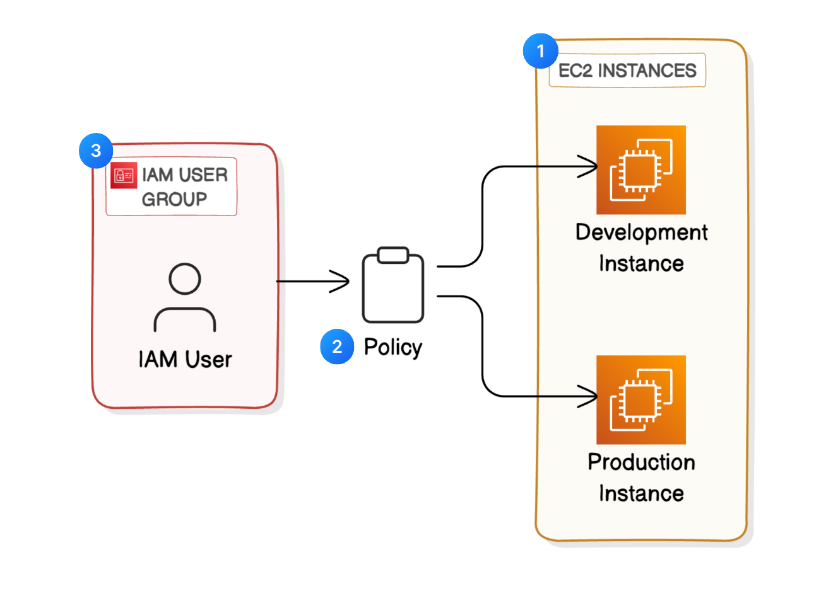
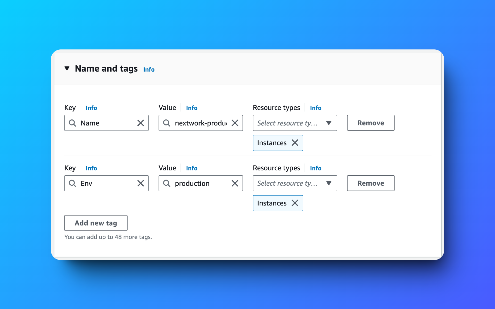
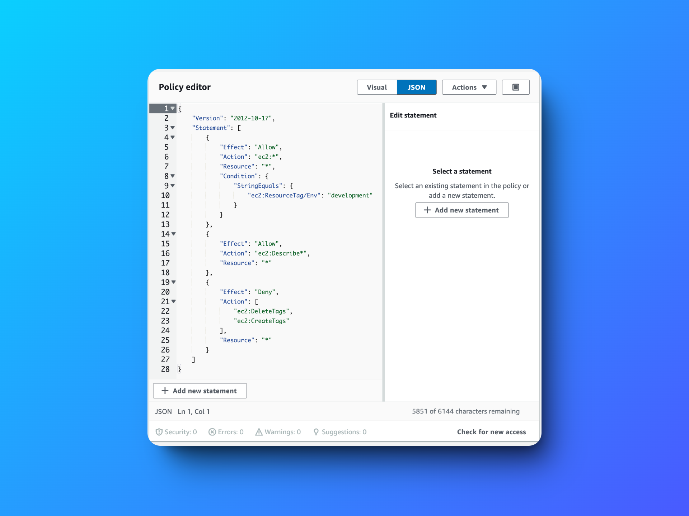

# Managing Permissions with AWS IAM

## Overview
This project demonstrates how to enhance security in a cloud environment using AWS Identity and Access Management (IAM). I learned to manage and secure access to AWS resources by setting up policies, users, and user groups.

## Key Learnings

- **Amazon EC2 Management**: Launched and managed EC2 instances to create scalable and reliable computing resources.
  
- **AWS IAM Deep Dive**: 
  - Created and applied IAM policies to define permissions and control access.
  - Set up IAM users and user groups to manage permissions efficiently.
  - Implemented tags on EC2 instances to organize resources and apply specific policies.

- **Practical Testing**: 
  - Tested permission settings by logging into my AWS account as a new IAM user.
  - Verified policy effectiveness by attempting actions on EC2 instances with varying levels of access.

## Project Highlights

- **Custom Sign-In URL**: Utilized an AWS Account Alias to create a user-friendly sign-in URL for my account.
- **Automated Permissions**: Demonstrated how IAM can automate permissions for new joiners or different environments.
- **Real-World Application**: This knowledge is applicable in setting up secure environments for web development and cloud-based solutions.

## Steps Taken

1. **Setting Up EC2 Instances**:
   - Created two EC2 instances tagged as "development" and "production."
   - Tags were used to test the effectiveness of IAM policies.
   

2. **IAM Policy Creation**:
   - Developed a JSON-based IAM policy allowing actions on resources tagged as "development" but restricting actions on "production" instances.

3. **User and Group Management**:
   - Created a user group (`nextwork-dev-group`) and attached the policy to control access.
   - Added a new IAM user to this group, ensuring they could only interact with the "development" environment.

4. **Testing**:
   - Logged in as the new IAM user to verify permissions.
   - Successfully restricted access to "production" resources while allowing actions in the "development" environment.

## Final Thoughts
This project enhanced my understanding of AWS IAM and its crucial role in securing cloud environments. By simulating real-world scenarios, I gained insights into effectively managing user access and permissions in a scalable cloud infrastructure.
